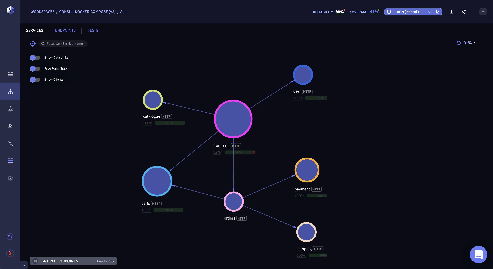

# Infer tests, mocks & observability from traffic with UP9, Consul & Docker-Compose

This repo demonstrates how to create traffic-inferred tests, contracts, observability and more that represent real-life application behavior. 

It includes:
* A demo microservice app (WeaveSock) 
* HashiCorp Consul configuration file 

## Requirements 
* An UP9 account - If you don't have one already, you can sign up for free here: https://up9.app/signup
* UP9 CLI installed - `npm install -g up9`
* Docker-compose installed

## Steps

* Log in to your UP9 account on https://up9.com/.
* Authenticate your UP9 CLI - In your terminal window - `up9 auth:login`
* Create the nessesary Envoy configuration files: `up9 tap:create-docker-compose-consul 19001 <give-it-a-name>`
* Run `docker-compose -f docker-compose.yaml -f docker-compose-up9.yaml up`

## Using the apps

* Consul UI is available at http://localhost:8500
* Demo app is available at http://localhost:8000

## Context
UP9 uses only Envoy configuration, to subscribe and unsubsribe to traffic events. UP9 observes traffic and infer tests, contracts, mocks and observability.

### Architecture
A Consul Connect sidecar (with Envoy proxy) is attached to each service and is controlled by the Consul Server.  
Envoy proxies enforce mTLS communication by only authorized clients to enforce secure communicate in the service mesh.

### Machine-generated test code
Test code is automatically generated in Python, Java, Javascript, Golang and Postman.

# Reliability and root-cause analysis
### Observability

## Service Contracts

See how your services interact with each other based on traffic, as well as export to Swagger format.

## Traffic Log

See the actual traffic observed by UP9 (think of Chrome Dev Tools for your cluster).

## Poking, Troubleshooting and Interacting with your Services

Payload is ready to send. Customize it or send it as-is. Poke and interact with your services in real time with immediate feedback.

## Dependency Map

**
Example of a service dependency map.
**

# What’s Next
It can take anywhere from a few hours to a few days to fully calibrate the UP9 models. Once models are generated, you’ll receive an email with further instructions.

UP9 should free up some time for you to start a new hobby :) Enjoy!
# Support

For support, feel free to use any one of the three:
* Schedule time with an UP9 staff member using this [link](https://calendly.com/up9/support).
* Email support@up9.com
* Use our in-app messaging application to start a conversation.
