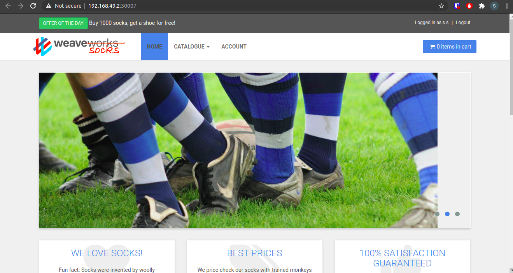

# weavesocks-kafka-up9-demo

This repository provides all necessaries files for deploy weavesocks on kubernetes cluster. And also includes a quick tutorial to use up9.app to monitoring those resources created.

## Create the cluster
It is needed to have a running kubernetes cluster to proceed. The next steps will show how to download minikube and start your own cluster.

## Download minikube
### Linux
Download the binary with:
```bash
$ curl -LO https://storage.googleapis.com/minikube/releases/latest/minikube-linux-amd64
$ sudo install minikube-linux-amd64 /usr/local/bin/minikube
```
### MacOS
If the Brew Package Manager installed:
```bash
$ brew install minikube
```
Otherwise,

*x86*
```bash
$ curl -LO https://storage.googleapis.com/minikube/releases/latest/minikube-darwin-amd64
sudo install minikube-darwin-amd64 /usr/local/bin/minikube
```
*ARM*
```bash
$ curl -LO https://storage.googleapis.com/minikube/releases/latest/minikube-darwin-arm64
sudo install minikube-darwin-arm64 /usr/local/bin/minikube
```

## Create the cluster

Simply run
```bash
$ minikube  start
```
And the cluster will be live in a few seconds (maybe minutes, it depends).
## Deploy weavesocks

Clone or download this repository and go to kafka-weavesocks-demo/kubernetes-resources folder. The next command will create all resources needed to run weavesocks project on the cluster.
```bash
$ kubectl apply -f . -n sock-shop
```

The kafka pod will restart 2-5 times before be marked as running, don't worry about it.

## Test the applicaton
To access the front-end of the application:


```bash
$ minikube ip
192.168.49.2
```
With this IP we can access on any browser: http://192.168.49.2:30007 *(The IP may change, pay attention)*




# Install UP9

Installing using Brew:

```bash
$ brew tap up9inc/brew && brew install up9
```

Installing using npm:
```bash
$ npm i -g up9
```

After installed, is it need to auth on up9.app. Use:
```bash
$ up9 auth:login
```
press Y and will open the up9.app website, authenticate with your email and password.
## Install UP9 Agent on the cluster
On up9.app, create a new workspace and select the prefer method to install: helm or kubectl. On the next step,
select the namespace sock-shop

Then it'll wait for some traffic be produced before shows the services on up9. To do that:
```bash
$ kubectl apply -R -f job/.
```
The function of theses jobs is generate traffic, to the whole application, and to the front-end.
