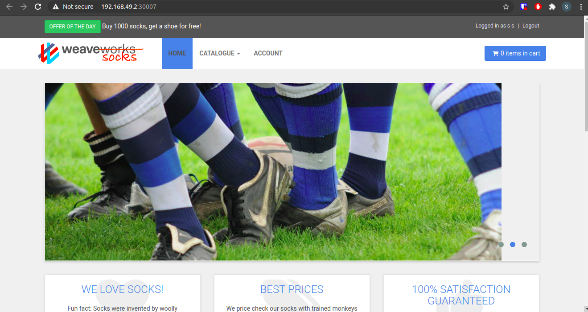
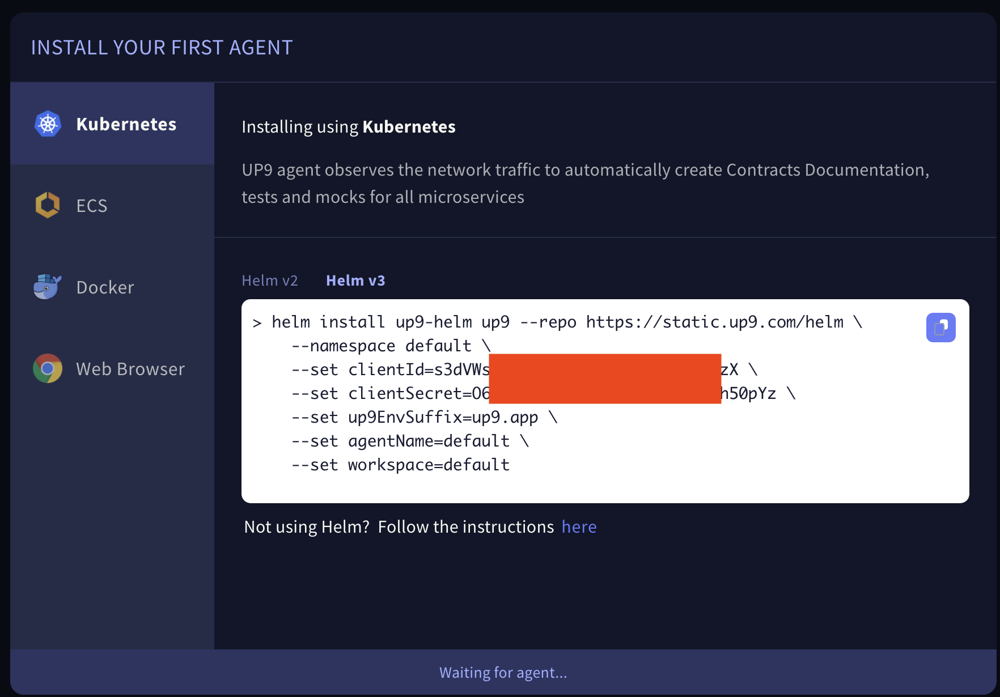

# UP9 / Weavesock / Kafka Demo Environment 

This repository includes all of the artifacts required to deploy Weavesock, a microservice application, on a Kubernetes cluster as well as a quick tutorial of how to use up9.

If you already have a Minikube or a Kubernetes cluster you can skip the part about downloading and installing Minikube in your local environment. 

## Installing Minikube and Helm
In this tutorial we are using Helm and Minikube. If you don't have these installed already, follow the instructions in the next paragraph.
### MacOS
```bash
$ brew install minikube helm
```
### Other OSs
Install Minikube: https://minikube.sigs.k8s.io/docs/start/
Install HELM: https://helm.sh/docs/intro/install/ 

## Starting the Cluster

```bash
$ minikube start --driver=hyperkit --memory=16384 --cpus=4 --disk-size=100g
```
## Deploy Weavesock

```bash
$ kubectl apply -f . -n sock-shop
```

Wait until the cluster is fully running before continuing. The kafka pod will restart 2-5 times, don't worry about it.

## Test the Applicaton
To access the front-end of the application:

Use the fowllowing command to identify the cluster IP:
```bash
$ minikube ip
<cluster-ip>
```
Use the IP on any browser: http://\<cluster-ip\>:30007 **(\<cluster-ip\> is the result of using the `minikube ip` command)**



# Install UP9

**Brew:**
```bash
$ brew tap up9inc/brew && brew install up9
```
**NPM:**
```bash
$ npm i -g up9
```
If you don't have an account in UP9, sign up to get an account here: https://up9.app/signup. Having an UP9 account is immediate and free.

```bash
$ up9 auth:login
```
## Install UP9 on Weavesock
In your UP9 dashboard (https://up9.app), create a new workspace and select the prefered installation method


Please make sure you choose the correct Helm version, copy this text, and run it in your terminal window.

### Select Namespaces or Services 
A few seconds after your pods are running, your browser screen should change, asking you to select the namespaces or services that UP9 will observe, listening to their traffic.
Select: `sock-shop` and follow the on-screen instructions

UP9 works by observing traffic. To generate traffic, you can simply use the application, but we recommend running a small load test: 

```bash
$ kubectl apply -R -f job/.
```
That's it UP9 is installed
